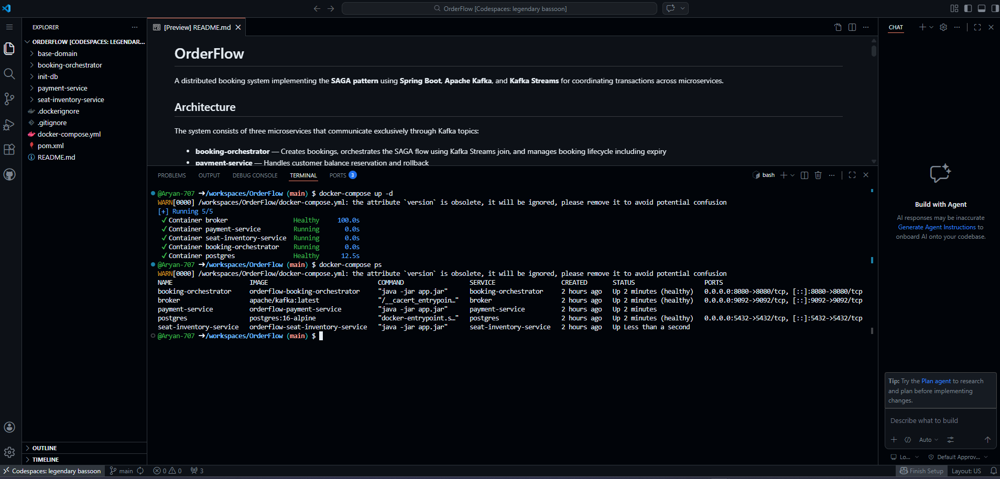
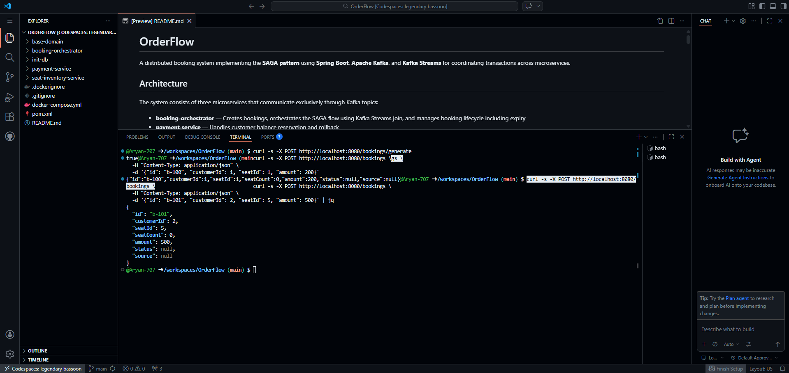
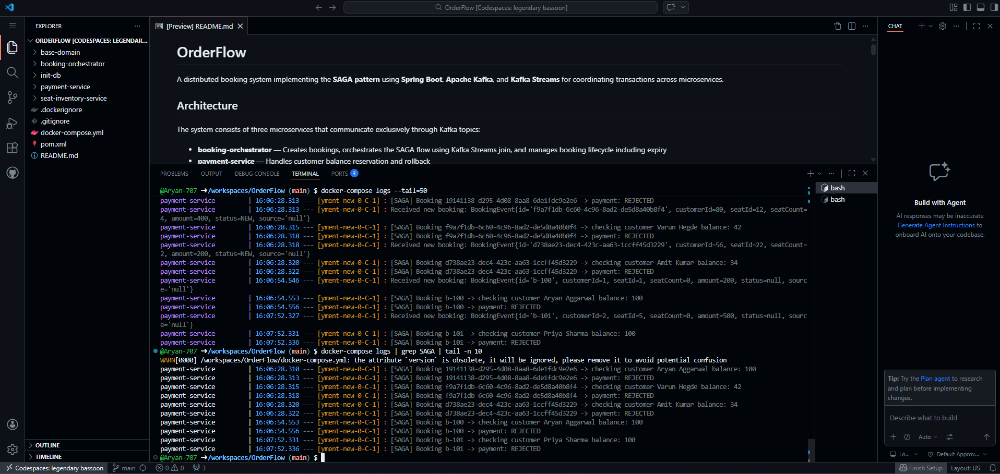

# 🚀 OrderFlow: My Microservices Booking System

Hi there! 👋 Welcome to my distributed booking system project. I built this to dive deep into microservices architecture and learn how complex systems talk to each other. 

It implements the **SAGA Pattern** using **Spring Boot**, **Apache Kafka**, and **Kafka Streams** to coordinate transactions safely across three different backend microservices.

---

## 📸 Live Demo & Screenshots

> **🌐 A Quick Note on Live Deployment (Why there is no live link)**  
> *Since this architecture runs three separate Spring Boot instances, a PostgreSQL database, and a fully-fledged Apache Kafka cluster, it requires a lot of RAM! As a fresher, keeping this hosted 24/7 on AWS/cloud servers was getting too expensive. But don't worry—I've tested it thoroughly! See the screenshots below showing the Kafka events and Docker containers in action, or follow the instructions at the bottom to spin it up locally in one click!*

### 1. The Setup (Everything running smoothly in Docker)

*(All 5 microservices booting up perfectly using Docker Compose)*

### 2. The API Trigger (Generating a Booking)

*(Sending a POST request to hit our Orchestrator endpoint)*

### 3. The SAGA Magic (Behind the scenes)

*(Kafka successfully routing messages between the Payment Service and Orchestrator to confirm the transaction!)*

---

## 🏗️ How it Works (Architecture)

The system is split into three main microservices that communicate *only* through Kafka topics. No direct HTTP calls!

- **booking-orchestrator**: Creates the initial booking and manages the SAGA flow using Kafka Streams.
- **payment-service**: Handles taking the customer's balance.
- **seat-inventory-service**: Books the physical seat.

**The SAGA Flow I implemented:**
1. A booking is created → published to `"bookings-new"`.
2. The Payment and Seat services process this in parallel.
3. They respond with `ACCEPTED` or `REJECTED`.
4. Kafka Streams joins both of these responses. 
5. If both accept, it's `CONFIRMED`. If one rejects, it `ROLLBACKS` the entire transaction via compensation!

---

## 💻 Tech Stack (What I Used)
- **Java 17** + **Spring Boot**
- **Apache Kafka** (No ZooKeeper, using KRaft)
- **Docker & Docker Compose**
- **PostgreSQL** + **Spring Data JPA**
- **Kafka Streams** 

---

## 🛠️ Want to Run this yourself? (Local Deployment)

Since I'm not hosting it live, I made it incredibly easy for anyone to test it locally. You only need **Docker**.

```bash
# 1. Clone this repository!
git clone https://github.com/Aryan-707/OrderFlow.git
cd OrderFlow

# 2. Spin up the entire multi-container architecture in one single command:
docker-compose up --build -d

# 3. Create a test booking yourself
curl -s -X POST http://localhost:8080/bookings \
  -H "Content-Type: application/json" \
  -d '{"id": "test-booking-1", "customerId": 1, "seatId": 1, "amount": 200}' | jq

# 4. View the magic in the logs!
docker-compose logs | grep SAGA | tail -n 15

# 5. Bring it all down
docker-compose down
```

Thanks for checking out my project!
